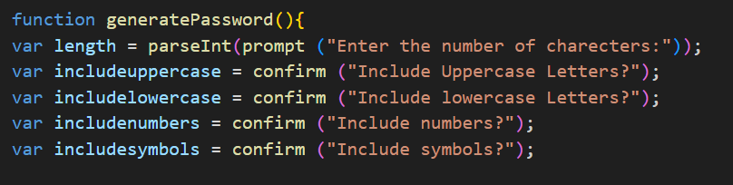
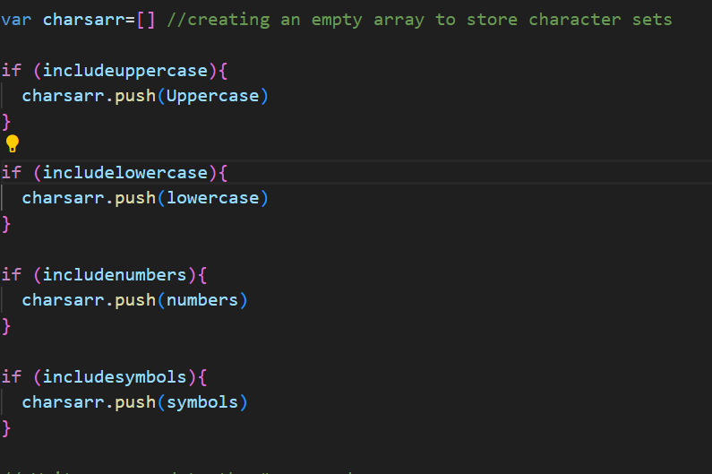
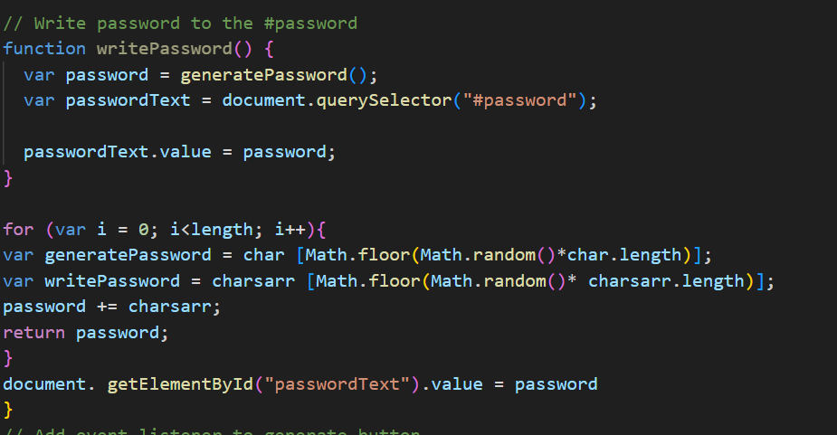
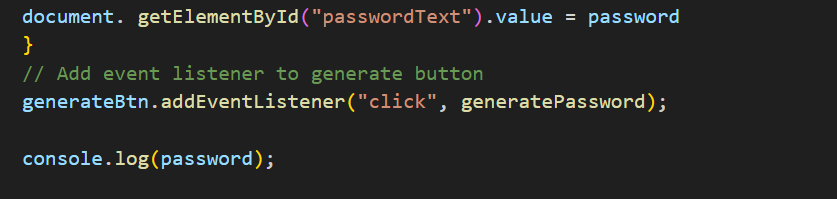

# Password-generator
Java Script Module:

To create a responsive javascript, I used the following code:

Istarted off by writing code that prompts useer to nter information that defines how they want the password; here, prompts request for password length, password criteria in terms of what letters, numbers or symbols they want. 

In this code I have declared variables of data that isused in generatinga random passwrd. This inlude uppercas eletters, lowercase letters, numbers and symbols. 

I then created an empty array, in which my variables are stored:

I then used a loop to iterate an arithmetic function that generates the radom password:
This was supposed to accomolish the following tasks:
- generate random password
- write generated password 
- upon listening to click, the password is supposed to show on the text area. 
However, on my console log i noticed tha some code lines do not define "writepassword" leaving me with unresponsive code reading some lines. 
a line of code that 

Finally, an event listener that outpts or displays the return password code:

In my code, the prompts work but the display failed. 
